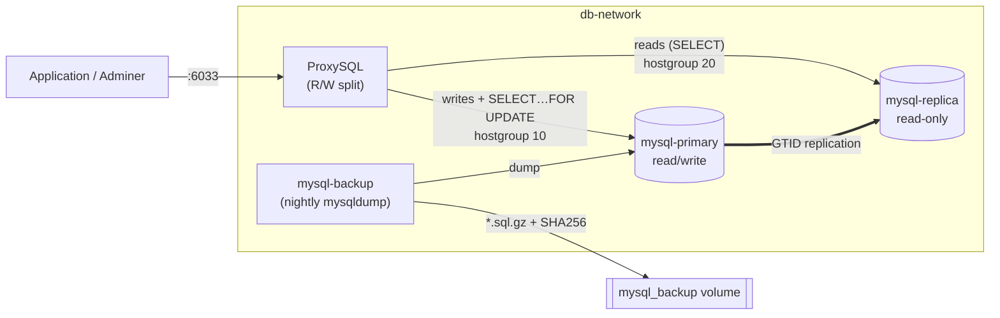

# Database Stack — `docker-compose.database.yml`

This stack owns **everything database-related** for the project: a MySQL
**primary + replica** (GTID replication), a **ProxySQL** router that splits
reads from writes, an automated **backup** service, plus **Adminer** (web UI)
and **Memcached** (application cache).



---

## 1. Components

| Service | Image / Build | Role | Ports |
|---|---|---|---|
| `mysql-primary` | `mysql:8.0` | Read/write source of truth. Binary logging + GTID enabled. | internal `3306` |
| `mysql-replica` | `mysql:8.0` | Read-only replica, replicates the primary over GTID. | internal `3306` |
| `proxysql` | build `../proxysql` | Single entry point for apps. Routes writes → primary, reads → replica. | `6033` (SQL), `127.0.0.1:6032` (admin) |
| `mysql-backup` | build `../backup-mysql` | Cron container: nightly `mysqldump` of every app DB + 30-day retention + restore script. | — |
| `adminer` | `adminer:4.8.1` | Web UI to browse the databases. | `8083` |
| `memcached` | `memcached:1.6-alpine` | Application cache. | `11211` |

### Volumes
`mysql_primary_data`, `mysql_replica_data`, `proxysql_data`,
`mysql_backup` (dumps), `mysql_backup_logs` (cron logs).

### Networks
* `db-network` (bridge) — internal traffic between all DB services.
* `public-network` (**external**) — shared with the main Traefik/nginx stack so
  Adminer is reachable. Create it once (see prerequisites).

### Secrets (Docker secrets, mounted at `/run/secrets/*`)
`mysql_root_password`, `db_password` (the app user), `replication_password`.
Files live in `../secrets/` and are git-ignored.

---

## 2. How it works

### Replication (primary → replica)
* Both servers run with `gtid_mode=ON` + `enforce_gtid_consistency=ON`.
* On the **primary's first boot**, `mysql/primary/init/10-replication.sh`
  creates:
  * `replica@%` — used by the replica's IO thread (`REPLICATION SLAVE`).
  * `monitor@%` — used by ProxySQL for health checks.
  * switches the app user (`appuser`) to `mysql_native_password` so ProxySQL can
    authenticate to the backend.
  These statements are written to the binlog, so they replicate automatically.
* On the **replica's first boot**, `mysql/replica/init/10-start-replica.sh`
  waits for the primary, then runs `CHANGE REPLICATION SOURCE TO … SOURCE_AUTO_POSITION=1`
  + `START REPLICA`, and finally `SET PERSIST super_read_only=ON`.
* The app schema (`../backend/init.sql`) is loaded on the primary and replicates
  to the replica.

### Read/Write split (ProxySQL)
* `proxysql/init.sql` registers both backends and a `mysql_replication_hostgroups`
  mapping `(writer=10, reader=20)`. ProxySQL's monitor reads each server's
  `read_only` flag and places the primary in **10** and the replica in **20**
  automatically (this also handles role changes / failover).
* Query rules: `SELECT … FOR UPDATE` → hostgroup 10 (primary); other `SELECT` →
  hostgroup 20 (replica); everything else → the user's default hostgroup (10).
* `proxysql/startup.sh` creates the frontend app user from the `db_password`
  secret at runtime, so it always matches the MySQL password without hard-coding
  it in config.

> ⚠️ Reads served by the replica can be slightly stale under replication lag.
> Use `SELECT … FOR UPDATE` (or route critical reads to the primary) when you
> need read-after-write consistency.

### Backups
* `mysql-backup` runs `dcron`. Two jobs (`backup-mysql/crontab`):
  * `02:00` — `backup.sh`: dumps every non-system database to
    `/backup/backups/<YYYY-MM-DD>/<db>.sql.gz` and writes a `SHA256SUMS` file.
  * `02:30` — `cleanup.sh`: keeps the **last 30** dated folders.
* `restore.sh` verifies checksums and restores one DB or `--all`.

---

## 3. Prerequisites

1. **Secrets** — make sure these files exist in `../secrets/` (copy from the
   `*.example` files and set real values):
   ```
   secrets/mysql_root_password
   secrets/db_password
   secrets/replication_password
   ```
2. **Environment** — `../.env` provides non-secret values:
   ```
   DB_DATABASE=appdb
   DB_USERNAME=appuser
   ```
3. **External network** — create the shared network once:
   ```bash
   docker network create public-network
   ```

---

## 4. Run it

From the **repository root**:

```bash
# build proxysql + backup images and start everything
docker compose -f compose/docker-compose.database.yml --env-file .env up -d --build

# follow logs
docker compose -f compose/docker-compose.database.yml logs -f mysql-replica proxysql
```

Stop / remove:

```bash
docker compose -f compose/docker-compose.database.yml down          # keep data
docker compose -f compose/docker-compose.database.yml down -v       # also wipe volumes
```

> **Note:** this is a standalone DB stack. It defines its own `memcached`, so do
> not run it at the same time as the root `docker-compose.yml` (they would clash
> on port `11211`). Point the app at ProxySQL instead (see §6).

---

## 5. Verify

**Replication health** (should show `Yes / Yes` and low lag):
```bash
docker exec mysql-replica sh -c \
  'mysql -uroot -p"$(cat /run/secrets/mysql_root_password)" -e "SHOW REPLICA STATUS\G"' \
  | grep -E "Replica_IO_Running|Replica_SQL_Running|Seconds_Behind_Source|Last_Error"
```

**ProxySQL backend pool** (primary in HG 10, replica in HG 20, both `ONLINE`):
```bash
docker exec proxysql mysql -h127.0.0.1 -P6032 -uadmin -padmin \
  -e "SELECT hostgroup_id, hostname, status FROM runtime_mysql_servers;"
```

**Query routing** (which hostgroup served each query):
```bash
docker exec proxysql mysql -h127.0.0.1 -P6032 -uadmin -padmin \
  -e "SELECT hostgroup, digest_text, count_star FROM stats_mysql_query_digest ORDER BY count_star DESC LIMIT 10;"
```

---

## 6. Connect the application

Point the backend at ProxySQL instead of a MySQL server directly:

```
DB_HOST=proxysql
DB_PORT=6033
DB_USERNAME=appuser        # from .env
DB_PASSWORD=<secrets/db_password>
```

The backend must share `db-network` with this stack.

---

## 7. Backup & restore usage

```bash
# run a backup on demand (instead of waiting for 02:00)
docker exec mysql-backup /backup/scripts/backup.sh

# list stored backups
docker exec mysql-backup ls -R /backup/backups

# restore ONE database from a given day
docker exec -it mysql-backup /backup/scripts/restore.sh 2026-07-20 appdb

# restore ALL databases from a given day
docker exec -it mysql-backup /backup/scripts/restore.sh 2026-07-20 --all
```

Backups are taken from the primary. To offload the primary you can repoint the
backup service at `mysql-replica` via the `MYSQL_HOST` environment variable.

---

## 8. Port reference

| Port | Service | Exposure | Purpose |
|---|---|---|---|
| `6033` | proxysql | host | App SQL traffic (use this) |
| `6032` | proxysql | `127.0.0.1` only | ProxySQL admin |
| `8083` | adminer | host | Web DB UI |
| `11211` | memcached | host | Cache |
| `3306` | mysql-primary / mysql-replica | internal | Not published to host |

---

## 9. What was reviewed & fixed

The original stack could not start or replicate. Fixes applied during review:

* **Undefined `mysql_backup_logs` volume** — added to the top-level `volumes:`
  (compose refused to start without it).
* **Replication never configured** — the referenced `mysql/*/init` folders were
  empty. Added `10-replication.sh` (primary) and `10-start-replica.sh` (replica)
  so replication + the required accounts are actually created.
* **ProxySQL had no config** — `init.sql` was never mounted, so `startup.sh`
  failed. It is now mounted at `/etc/proxysql-init.sql`, `startup.sh` waits for
  the admin port and loads config robustly.
* **Wrong ProxySQL topology** — it referenced `mysql-replica-1/2` (non-existent)
  and a hard-coded `app/password` user. Rewritten for the real single replica,
  with `mysql_replication_hostgroups` and the app user built from the secret.
* **Missing MySQL client in ProxySQL image** — added `proxysql/Dockerfile` that
  installs it (needed by `startup.sh`).
* **`super_read_only` in replica `my.cnf`** — would break first-time init;
  replaced with a runtime `SET PERSIST super_read_only=ON`.
* **Deterministic socket path** for the init scripts / healthchecks.
* **CRLF line endings** in `backup-mysql/crontab` and `proxysql/proxysql.cnf`
  converted to LF (they broke cron / config parsing inside Linux containers).
* Removed the obsolete `version:` key; small consistency fixes in `backup.sh`.

## 10. Hardening TODO (not blocking)

* Replace ProxySQL `admin:admin` and the `monitor123` password with secrets.
* Enable TLS between ProxySQL and the MySQL backends.
* Ship backups off-host (S3 / remote) — currently they live in a local volume.
